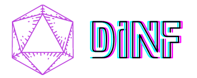

**dInf** (infinity dice) - project for creating random generators and sharing them with others.

Sample website: [dinf.ustits.dev](https://dinf.ustits.dev)

## Project structure

- [app](app/README.md) - server application with domain's adapter implementations
- [domain](domain) - domain logic, types and adapter interfaces
- [libs](libs) - shareable artifacts between the modules and/or projects

## Configuration

To overload [log configuration](app/src/main/resources/logback.xml) pass `logback.configurationFile` 
system property. For example via `JAVA_OPTS` environment variable:

```shell
export JAVA_OPTS='-Dlogback.configurationFile=/path/to/config.xml'
```

To enable call logging:

```xml
<logger name="ktor.application" level="DEBUG"/>
```
